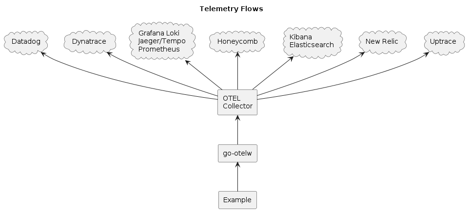

# Golang OpenTelemetry Toolkit  


[](https://pkg.go.dev/github.com/yolkhovyy/go-otelw)
[](https://goreportcard.com/report/github.com/yolkhovyy/go-otelw)

Golang OpenTelemetry Toolkit includes: 

🚀 **Golang utilities for simple OpenTelemetry instrumentation, configuration and shutdown**  
✨ **OTEL Collector configuration examples for popular observability platforms**  

Observability backend examples included:
  * [Datadog](docs/datadog.md)
  * [Dynatrace](docs/dynatrace.md)
  * [Elasticsearch Kibana](docs/elasticsearch-kibana.md)
  * [Grafana Cloud](docs/grafana-cloud.md)
  * [Grafana Cloud Alloy](./docs/grafana-cloud-alloy.md)
  * [Grafana Loki, Jaeger, Prometheus](./docs/grafana-loki-jaeger-prometheus.md)
  * [Grafana Loki, Tempo, Prometheus](./docs/grafana-loki-tempo-prometheus.md)
  * [Honeycomb](./docs/honeycomb.md)
  * [New Relic](./docs/new-relic.md)
  * [OpenObserve](./docs/openobserve.md)
  * [Uptrace](./docs/uptrace.md)


⚠️ This project is pre-v1.0.0 and may change.

`go-otelw` is pronounced /ˈɡuːtldʌb/- short for Go OpenTelemetry Wrapper.

## Content
* [Toolkit Overview](#toolkit-overview)
* [How to Use go-otelw](#how-to-use-go-otelw)
  * [Config Types](#config-types)
  * [Configure and Shutdown Utilities](#configure-and-shutdown-utilities)
  * [Tracing and Logging Examples](#tracing-and-logging-examples)

## Toolkit Overview
The diagram below illustrates how telemetry from the Example service, instrumented and configured with `go-otelw`, can be routed via the OTEL Collector to any OTEL-compatible backend—or even to multiple backends at once. 

Simply instrument and configure your services with `go-otelw`, and use provided OTEL Collector configuration examples to route telemetry to the observability backend of your choice.



💡 The main purpose of this toolkit is to provide `Configure()` and `Shutdown()` utilities which abstract away the complexity of OpenTelemetry setup and shutdown. For example, configuring and shutting down a tracer looks like this:
```golang
	tracer, err := tracew.Configure(ctx, config.Tracer, other params)
	...
	defer func() {
		err := tracer.Shutdown(ctx)
		...
	}()
```

where [config.Tracer](./otelw/config.go#L11-L20) is loaded from [environment](./.env.local) variables:
```env
...
EXAMPLE_TRACER_ENABLE=true
EXAMPLE_TRACER_COLLECTOR_PROTOCOL=grpc
EXAMPLE_TRACER_COLLECTOR_CONNECTION=otel-collector:4317
...
```

or, from a configuration file, e.g. in [YAML](./cmd/example/config.yml) format:
```yml
...
Tracer:
  Enable: true
  Collector:
    Protocol: grpc
    Connection: localhost:4318
...
```

💡 This toolkit also provides OTEL Collector configuration [examples](./config/) for popular observability backends—both commercial and open source.

## Package Content
* Golang OpenTelemetry [Wrapper](./otelw/)
* OTEL Collector configuration [Examples](./config/otel-collector/)
* Usage [Example](./cmd/example/) - HTTP Echo Service
* Docker [Compose](./docker-compose.yml) to run the Echo Service and its dependencies

## How to Use go-otelw
### Install
```bash
go get github.com/yolkhovyy/go-otelw@latest
```

### Config Types
`go-otelw` provides convenience config types for logger, tracer, metric in [otelw/config.go](./otelw/config.go#L11-L20)
```go
type Config struct {
	// Logging configuration
	Logger slogw.Config   `yaml:"logger" mapstructure:"Logger"`
	
	// Tracing configuration
	Tracer tracew.Config  `yaml:"tracer" mapstructure:"Tracer"`
	
	// Metrics configuration
	Metric metricw.Config `yaml:"metric" mapstructure:"Metric"`
}
```
and OTEL Collector in [otelw/collector/config.go](./otelw/collector/config.go#L6-L18)
```go
type Config struct {
	// Protocol to use for telemetry collection - GRPC (default), HTTP.
	Protocol Protocol `yaml:"protocol" mapstructure:"protocol"`

	// Address of the telemetry collector service
	Connection string `yaml:"connection" mapstructure:"connection"`

	// Whether to use an insecure connection (without TLS)
	Insecure bool `yaml:"insecure" mapstructure:"insecure"`

	// TLS configuration settings
	TLS TLS `yaml:"tls" mapstructure:"tls"`
}
```
`go-otelw` configuration can be loaded from YAML or JSON files on application startup. An example of YAML configuration is in [cmd/example/config.yml](./cmd/example/config.yml)

### Configure and Shutdown Utilities
`go-otelw` simplifies the use of OpenTelemetry by providing `Configure()` and `Shutdown()` utility functions for logger, tracer and metric.

#### All-in Configuration and Shutdown Example
See [cmd/example/main.go](./cmd/example/main.go#L60-L75)

```golang
	serviceAttributes := []attribute.KeyValue{
		semconv.ServiceNameKey.String(serviceName),
		semconv.ServiceVersionKey.String(version.Tag),
	}
	
	logger, tracer, metric, err := otelw.Configure(ctx, config.Config, serviceAttributes)
	if err != nil {
		fmt.Fprintf(os.Stderr, "otelw configure: %v", err)

		return osx.ExitFailure
	}

	defer func() {
		err := errors.Join(err,
			metric.Shutdown(ctx),
			tracer.Shutdown(ctx),
			logger.Shutdown(ctx))
		if err != nil {
			fmt.Fprintf(os.Stderr, "otelw shutdown: %v", err)
		}
	}()
```

#### Individual Logger, Tracer and Metric Configuration
See [cmd/example/internal/otelw/otelw.go](./cmd/example/internal/otelw/otelw.go#L21-L34)

```golang
	logger, err := slogw.Configure(ctx, config.Logger, attrs, writers...)
	if err != nil {
		return nil, nil, nil, fmt.Errorf("slogw configure: %w", err)
	}

	tracer, err := tracew.Configure(ctx, config.Tracer, attrs, writers...)
	if err != nil {
		return nil, nil, nil, fmt.Errorf("tracew configure: %w", err)
	}

	metric, err := metricw.Configure(ctx, config.Metric, attrs, writers...)
	if err != nil {
		return nil, nil, nil, fmt.Errorf("metricw configure: %w", err)
	}

```

### Tracing and Logging Examples
See [cmd/example/internal/domain/domain.go](./cmd/example/internal/domain/domain.go#L75-L110)

```golang
	ctx, span := tracew.Start(ctx, "echo", "worker"+strconv.Itoa(sequence))
	defer func() { span.End(err) }()

	logger := slogw.DefaultLogger()
	logger.InfoContext(ctx, msg, 
		slog.Int("sequence", sequence),
		slog.String("input", input),
	)
```
