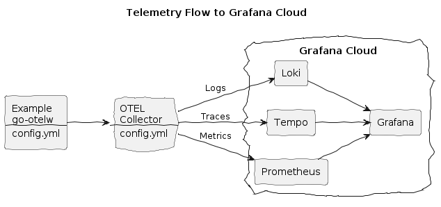
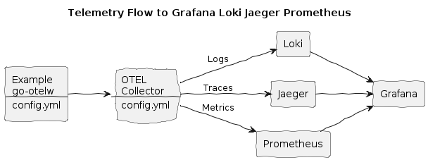

# Go OpenTelemetry Wrapper

This is a Go OpenTelemetry playground project. It provides a wrapper for OpenTelemetry with the goal of simplifying its integration and usage.

Pronounced as /ˈɡuːtldʌb/

## Content
* [Package Content](#package-content)
* [How to Integrate OpenTelemetry with go-otelw](#how-to-integrate-opentelemetry-with-go-otelw)
  * [Configuration and Shutdown](#configuration-and-shutdown)
  * [Logger and Tracer Example](#logger-and-tracer-example)
* [Build and Run the Example](#build-and-run-the-example)
  * [Grafana Cloud Integration](#grafana-cloud-integration)
  * [Grafana Cloud Alloy Integration](#grafana-cloud-alloy-integration)
  * [Grafana Loki, Jaeger, Prometheus Integration](#grafanaloki-jaeger-prometheus-integration)
  * [Grafana Loki, Tempo, Prometheus Integration](#grafanaloki-tempo-prometheus-integration)
  * [Uptrace Integration](#uptrace-integration)
  * [Newrelic Integration](#newrelic-integration)

## Package Content
* The [wrapper](./pkg/) itself
* Usage [example](./cmd/example/) - HTTP Echo Service
* Docker [Compose](./docker-compose.yml) to run the Echo Service and its dependencies
* [Config](./config/) files for 3rd-party dependencies
	* [Grafana](./config/grafana/)
	* [Jaeger](./config/jaeger/)
	* [Loki](./config/loki/)
	* [Prometheus](./config/prometheus/)
	* [Promtail](./config/promtail/)
	* [Tempo](./config/tempo/)
	* [Uptrace](./config/uptrace/)

## How to Integrate OpenTelemetry with go-otelw

### Configuration and Shutdown

See [cmd/example/main.go](https://github.com/yolkhovyy/go-otelw/blob/main/cmd/example/main.go#L60-L75)

```golang
	logger, tracer, metric, err := otelw.Configure(ctx, config.Config, serviceAttributes)
	if err != nil {
		fmt.Fprintf(os.Stderr, "otelw configure: %v", err)

		return osx.ExitFailure
	}

	defer func() {
		err := errors.Join(err,
			metric.Shutdown(ctx),
			tracer.Shutdown(ctx),
			logger.Shutdown(ctx))
		if err != nil {
			fmt.Fprintf(os.Stderr, "otelw shutdown: %v", err)
		}
	}()
```

### Logger and Tracer Example

See [cmd/example/internal/daemon/daemon.go](https://github.com/yolkhovyy/go-otelw/blob/main/cmd/example/internal/domain/domain.go#L75-L110)

```golang
	ctx, span := tracew.Start(ctx, "echo", "worker"+strconv.Itoa(sequence))
	defer func() { span.End(err) }()

	logger := slogw.DefaultLogger()
```

## Build and Run the Example

### Grafana Cloud Integration


**Create:**
* Grafana Cloud account
* Grafana Cloud API key

**Make `.env.secrets` file with your Grafana Cloud API key, endpoint and username:**
```bash
GCLOUD_API_KEY="glc_..."
GCLOUD_ENDPOINT="https://otlp-gateway-ENV-REGION.grafana.net/otlp"
GCLOUD_USERNAME=12345678
```

**Install the env vars:**
```bash
make install-env
```

**Build and run the Example, with GCL flag:**
```bash
make doco-build-up GCL=1
```

**Make a few HTTP requests to the Example HTTP Echo Service:**
```bash
./test/scripts/echo.sh
./test/scripts/echo.sh hey 10
```

**Observe logs, traces and metrics in Grafana Cloud:**
* Open your dashboard, e.g. `https://STACKNAME.grafana.ne/`

**Stop the services:**
```bash
make doco-down GCL=1
```

### Grafana Cloud Alloy Integration


**Create:**
* Grafana Cloud account
* Grafana Cloud API key

**Make `.env.secrets` file with your Grafana Cloud API key, endpoint and username:**
```bash
GCLOUD_API_KEY="glc_..."
GCLOUD_ENDPOINT="https://otlp-gateway-ENV-REGION.grafana.net/otlp"
GCLOUD_USERNAME=12345678
```

**Install the env vars:**
```bash
make install-env
```

**Build and run the Example, with ALY flag:**
```bash
make doco-build-up ALY=1
```

**Make a few HTTP requests to the Example HTTP Echo Service:**
```bash
./test/scripts/echo.sh
./test/scripts/echo.sh hey 10
```

**Observe logs, traces and metrics in Grafana Cloud:**
* Open your dashboard, e.g. `https://STACKNAME.grafana.ne/`

**Stop the services:**
```bash
make doco-down ALY=1
```

### Grafana Loki, Jaeger, Prometheus Integration


**Build and run the Example:**
```bash
make doco-build-up
```

This will start the `Example` Echo Service, and the telemetry services - `OTEL collector`, `Grafana/Loki`, `Jaeger`, and `Prometheus`.

**Make a few HTTP requests to the Example Echo Service:**
```bash
./test/scripts/echo.sh
./test/scripts/echo.sh hey 10
```

**Observe logs, traces and metrics in OTEL Collector's logs:**
```bash
docker compose logs -f otel-collector
```

**Explore logs, traces and metrics:**
* Logs
  * Garfana: http://localhost:3000
  	* Explore - Select data source `Loki` - Select label `service_name` - Select value `example` - Click `Run query`
* Traces
  * Jaeger: http://localhost:16686
  * Garfana: http://localhost:3000
  	* Explore - Select data source `Jaeger` - Click Query type `Search` - Select service name `example` - Click `Run query` 
* Metrics
  * Prometheus: http://localhost:9090
  * Garfana: http://localhost:3000
  	* Explore - Select Prometheus data source - Select a metric - Click `Run query`

**Stop the services:**
```bash
make doco-down
```

### Grafana Loki, Tempo, Prometheus Integration


**Build and run the Example:**
```bash
make doco-build-up GLT=1
```

This will start the `Example` Echo Service, and the telemetry services - `OTEL collector`, `Grafana/Loki`, `Tempo`, and `Prometheus`.

**Make a few HTTP requests to the Example Echo Service:**
```bash
./test/scripts/echo.sh
./test/scripts/echo.sh hey 10
```

**Observe logs, traces and metrics in OTEL Collector's logs:**
```bash
docker compose logs -f otel-collector
```

**Explore logs, traces and metrics:**
* Logs
  * Garfana: http://localhost:3000
  	* Explore - Select data source `Loki` - Select label `service_name` - Select value `example` - Click `Run query`
* Traces
  * Garfana: http://localhost:3000
  	* Explore - Select data source `Tempo` - Click Query type `Search` - Select service name `example` - Click `Run query` 
* Metrics
  * Prometheus: http://localhost:9090
  * Garfana: http://localhost:3000
  	* Explore - Select Prometheus data source - Select a metric - Click `Run query`

**Stop the services:**
```bash
make doco-down GLT=1
```

### Uptrace Integration


**Make `.env.secrets` file with your uptrace endpoint:**
```bash
UPTRACE_DSN=http://project1_secret_token@localhost:14318?grpc=14317
```

**Install the env vars:**
```bash
make install-env
```

**Build and run the Example, with the Uptrace UPT flag:**
```bash
make doco-build-up UPT=1
```

**Make a few HTTP requests to the Example HTTP Echo Service:**
```bash
./test/scripts/echo.sh
./test/scripts/echo.sh hey 10
```

**Observe logs, traces and metrics in Uptrace:**
* Open your dashboard, e.g. `http://localhost:14317/`

**Stop the services:**
```bash
make doco-down UPT=1
```

### New Relic Integration


**Create:**
* Newrelic account
* Newrelic ingest license API key

**Make `.env.secrets` file with your New Relic endpoint and license API key:**
```bash
NEWRELIC_ENDPOINT=https://otlp.eu01.nr-data.net:4317
NEWRELIC_API_KEY=eu01xx...
```

**Install the env vars:**
```bash
make install-env
```

**Build and run the Example, with the Newrelic NR flag:**
```bash
make doco-build-up NR=1
```

**Make a few HTTP requests to the Example HTTP Echo Service:**
```bash
./test/scripts/echo.sh
./test/scripts/echo.sh hey 10
```

**Observe logs, traces and metrics in Newrelic:**
* Open your dashboard, e.g. `https://one.eu.newrelic.com/`

**Stop the services:**
```bash
make doco-down NR=1
```

## Miscellaneous

**Grafana**
* [Jaeger provisioning](https://grafana.com/docs/grafana/latest/datasources/jaeger/#provision-the-data-source)
* [Tempo provisioning](https://grafana.com/docs/grafana/latest/datasources/tempo/configure-tempo-data-source/#example-file)
  * Useful dashboards:
    * Logs/App, ID: 13639

**Uptrace**
* [Config example](https://github.com/uptrace/uptrace/blob/master/example/docker/otel-collector.yaml)
