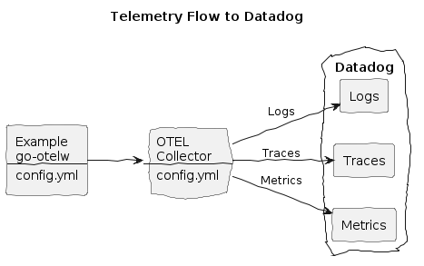

# Datadog Integration


**Create:**
* Datadog account
* Datadog API key

**Make `.env.secrets` file with your Datadog site and API key:**
```env
DD_SITE=datadoghq.eu
DD_API_KEY=12345...
```

**Install the env vars:**
```bash
make install-env
```

**Build and run the Example, with DD flag:**
```bash
make doco-build-up DD=1
```

**Make a few HTTP requests to the Example HTTP Echo Service:**
```bash
./test/scripts/echo.sh
./test/scripts/echo.sh hey 10
```

**Observe logs, traces and metrics in Datadog:**
* Open your dashboard, e.g. `https://app.datadoghq.eu/`

**Stop the services:**
```bash
make doco-down DD=1
```

## Miscellaneous

**Datadog**
* [OTEL Collector configuration](https://app.datadoghq.eu/signup/agent?platform=OpenTelemetry)
* [OTEL Collector config example](https://github.com/open-telemetry/opentelemetry-collector-contrib/blob/main/exporter/datadogexporter/examples/ootb-ec2.yaml)

