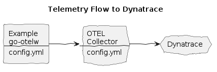

# Dynatrace Integration


**Create:**
* Dynatrace account
* Dynatrace access token
  * Click Apps, find Manage, click Access Tokens

**Make `.env.secrets` file with your Dynatrace tenant and access key (API token):**
```env
DT_TENANT=abc12345
DT_API_TOKEN=dt0c01...
```

**Install the env vars:**
```bash
make install-env
```

**Build and run the Example, with DT flag:**
```bash
make doco-build-up DT=1
```

**Make a few HTTP requests to the Example HTTP Echo Service:**
```bash
./test/scripts/echo.sh
./test/scripts/echo.sh hey 10
```

**Observe logs, traces and metrics in Dynatrace:**
* Open your Dynatrace dashboard
* Click Apps, find Observe and explore, start Logs, Distributed Tracing, Metrics

**Stop the services:**
```bash
make doco-down DT=1
```

## Miscellaneous

**Dynatrace**
* [Access token](https://docs.dynatrace.com/docs/discover-dynatrace/references/dynatrace-api/basics/dynatrace-api-authentication#generate-token--access-token)

