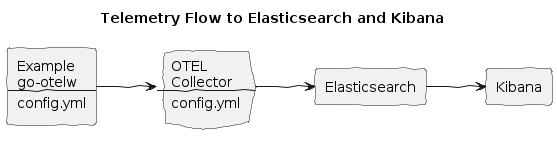

# Elasticsearch Kibana Integration


**Build and run the Example, with EK flag:**
```bash
make doco-build-up EK=1
```

**Make a few HTTP requests to the Example HTTP Echo Service:**
```bash
./test/scripts/echo.sh
./test/scripts/echo.sh hey 10
```

**Observe logs, traces and metrics in Kibana:**
* Open Kibana dashboard `http://localhost:5601/`
* Click `Observability`, `Discover`
* Make `otel-*` index pattern, click `Save`

**Stop the services:**
```bash
make doco-down EK=1
```
