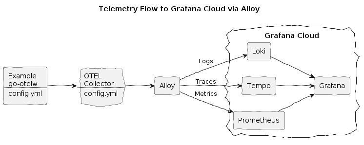

### Grafana Cloud Alloy Integration


**Create:**
* Grafana Cloud account
* Grafana Cloud API key

**Make `.env.secrets` file with your Grafana Cloud API key, endpoint and username:**
```env
GCLOUD_API_KEY="glc_..."
GCLOUD_ENDPOINT="https://otlp-gateway-ENV-REGION.grafana.net/otlp"
GCLOUD_USERNAME=12345678
```

**Install the env vars:**
```bash
make install-env
```

**Build and run the Example, with ALY flag:**
```bash
make doco-build-up ALY=1
```

**Make a few HTTP requests to the Example HTTP Echo Service:**
```bash
./test/scripts/echo.sh
./test/scripts/echo.sh hey 10
```

**Observe logs, traces and metrics in Grafana Cloud:**
* Open your dashboard, e.g. `https://STACKNAME.grafana.ne/`

**Stop the services:**
```bash
make doco-down ALY=1
```
