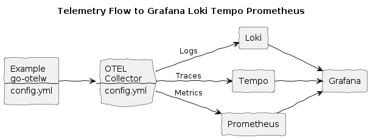

# Grafana Loki, Tempo, Prometheus Integration


**Build and run the Example:**
```bash
make doco-build-up GLT=1
```

This will start the `Example` Echo Service, and the telemetry services - `OTEL collector`, `Grafana/Loki`, `Tempo`, and `Prometheus`.

**Make a few HTTP requests to the Example Echo Service:**
```bash
./test/scripts/echo.sh
./test/scripts/echo.sh hey 10
```

**Observe logs, traces and metrics in OTEL Collector's logs:**
```bash
docker compose logs -f otel-collector
```

**Explore logs, traces and metrics:**
* Logs
  * Garfana: http://localhost:3000
    * Explore - Select data source `Loki` - Select label `service_name` - Select value `example` - Click `Run query`
* Traces
  * Garfana: http://localhost:3000
    * Explore - Select data source `Tempo` - Click Query type `Search` - Select service name `example` - Click `Run query` 
* Metrics
  * Prometheus: http://localhost:9090
  * Garfana: http://localhost:3000
    * Explore - Select Prometheus data source - Select a metric - Click `Run query`

**Stop the services:**
```bash
make doco-down GLT=1
```
