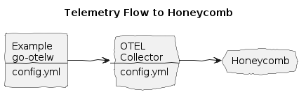

# Honeycomb Integration


**Create:**
* Honeycomb account
* Honeycomb header

**Make `.env.secrets` file with your Honeycomb site and API key:**
```env
HC_ENDPOINT=https://api.honeycomb.io
HC_TEAM=XJY...
```

**Install the env vars:**
```bash
make install-env
```

**Build and run the Example, with HC flag:**
```bash
make doco-build-up HC=1
```

**Make a few HTTP requests to the Example HTTP Echo Service:**
```bash
./test/scripts/echo.sh
./test/scripts/echo.sh hey 10
```

**Observe logs, traces in Honeycomb:**
* Open your dashboard, e.g. `https://ui.honeycomb.io/`

**Stop the services:**
```bash
make doco-down HC=1
```
