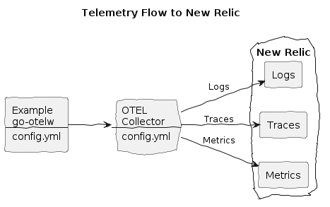

# New Relic Integration


**Create:**
* New Relic account
* New Relic ingest license API key

**Make `.env.secrets` file with your New Relic endpoint and license API key:**
```env
NEWRELIC_ENDPOINT=https://otlp.eu01.nr-data.net:4317
NEWRELIC_API_KEY=eu01xx...
```

**Install the env vars:**
```bash
make install-env
```

**Build and run the Example, with NR flag:**
```bash
make doco-build-up NR=1
```

**Make a few HTTP requests to the Example HTTP Echo Service:**
```bash
./test/scripts/echo.sh
./test/scripts/echo.sh hey 10
```

**Observe logs, traces and metrics in New Relic:**
* Open your dashboard, e.g. `https://one.eu.newrelic.com/`

**Stop the services:**
```bash
make doco-down NR=1
