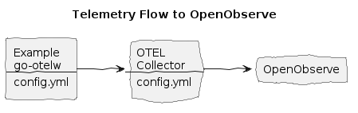

# OpenObserve Integration


**Create:**
* OpenObserve account
* Get Organization Id and API key

**Make `.env.secrets` file with your Dynatrace tenant and access key (API token):**
```env
OO_ORG_ID=abc...
OO_API_KEY=iKX...
```

**Install the env vars:**
```bash
make install-env
```

**Build and run the Example, with OO flag:**
```bash
make doco-build-up OO=1
```

**Make a few HTTP requests to the Example HTTP Echo Service:**
```bash
./test/scripts/echo.sh
./test/scripts/echo.sh hey 10
```

**Observe logs, traces and metrics in Dynatrace:**
* Open your OpenObserve dashboard
* Find Logs, Traces, Metrics

**Stop the services:**
```bash
make doco-down OO=1
```
