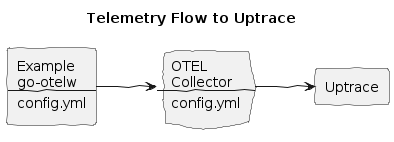

# Uptrace Integration


**Make `.env.secrets` file with your uptrace endpoint:**
```env
UPTRACE_DSN=http://project1_secret_token@localhost:14318?grpc=14317
```

**Install the env vars:**
```bash
make install-env
```

**Build and run the Example, with the Uptrace UPT flag:**
```bash
make doco-build-up UPT=1
```

**Make a few HTTP requests to the Example HTTP Echo Service:**
```bash
./test/scripts/echo.sh
./test/scripts/echo.sh hey 10
```

**Observe logs, traces and metrics in Uptrace:**
* Open your dashboard, e.g. `http://localhost:14317/`

**Stop the services:**
```bash
make doco-down UPT=1
```

## Miscellaneous

**Uptrace**
* [Config example](https://github.com/uptrace/uptrace/blob/master/example/docker/otel-collector.yaml)

